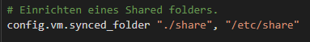
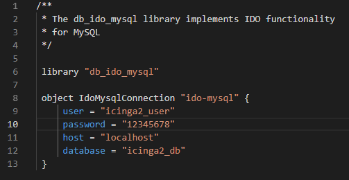

# LB01 - Automatiesiert einen Service bereitstellen.

## Einleitung
Im ersten Schritt wird die gesmate LB01 erleutert und gezeigt. in welcher es darum ging einen Server und einen darauf installierten Service automatisiert zur Verfügung zu stellen. Ich habe mich dabei für einen Ubuntuserver 18.04 LTS entschiden. Was den Service angeht habe ich mich für Icinga2 entschiden. Dies ist ein Monitoring Tool, mit welchem man Services und den Status von Servern überwachen kann.

Um dies zu bewerkstelligen, sind ein paar Programme nötig. Es wurden vagrant installiert, eine Software um automatisiert VMs zu starten. Dazu wurden die Virtualisierungs Software VirtualBox von Oracle installiert, um die benötigten MVs laufen zu lassen.

## Vagrantfile
Um eine VM via Vagrant zu starten ist ein Vagrant File nötig, indem alle Konfigurationen angegeben sind. Dieses sogenannte vagrantfile ist hier zu finden. --> [vagrantfile](ubuntuserver/vagrantfile)

## Config.sh
Da dies nur die Installation der VM beinhaltet müssen danach noch alle Befehle definiert werden, die die VM nach der Installation ausführen soll. Dazu wurde im vagrantfile das config.sh File angegeben, welches diesen Inhalt beherbergt. Dies finden sie hier. --> [config.sh](ubuntuserver/config_v4.1.sh).

## Sharefolder
Da mehrere Files bearbeitet wurden, war es am einfachsten einen Sharefolder zu erstellen, in dem sich die bereits bearbeiteten Files befanden, und dann nur noch kopiert werden mussten. Im Sharedfolder befand sich ein php.ini und ein ido-mysql.conf, welche wichtige Einstellungen mit sich brachten. Den Inhalt des Sharefolders finden sie hier. --> [Sharefolder](share/).

Ein Sharedfolder kann mit folgender Linie im vagrantfile definiert werden.

Das ido-mysql.conf File. In diesem File werden die Angaben für die mySQL Datenbank icinga2_db gemacht, die für die Ablage der Daten verantwortlich ist.

## Backups und Versionierung
Ich habe meine grösseren Änderungen stehts in neuen Versionen festgehalten. Diese sind im Backup ordner zu finden. Neben den verschiedenen Versionen wurden hier auch alle debug files gelagert, welche benutzt wurden um einzelne Fehlerquellen zu finden. Den Backupordner finden sie hier. --> [Backups](Backups/)