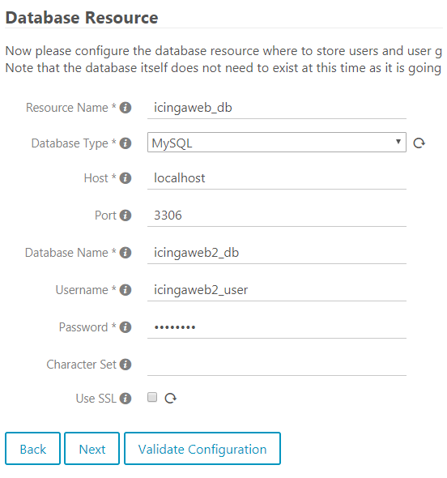
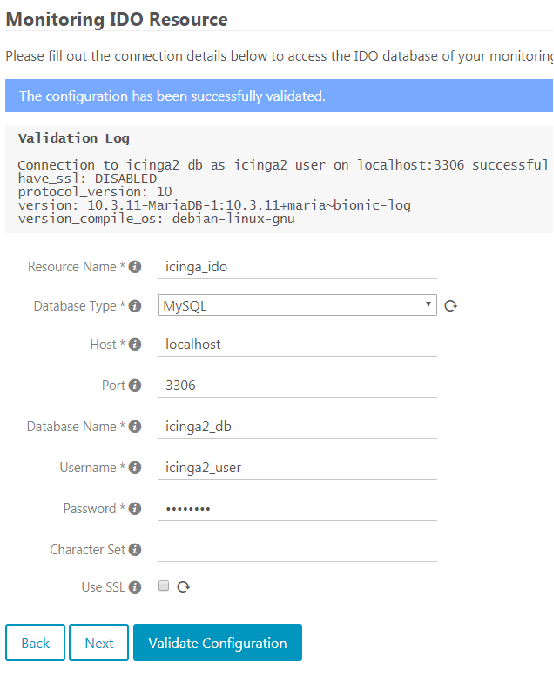

# Icinga2

# Inhalt
- Icinga2 und Icingaweb2
- Inizialisierung Webgui

## Icinga2 und Icingaweb2
Icinga ist ein opensource zur Server- und Workstationüberwachung. Dabei werden in den meisten Fällen zwei seperate Services installiert. Icinga2 welcher der generelle Service ser Überwachungssoftware ist, und Icingaweb2 welcher das grafische Webgui stellt. Das Webgui muss aber befor es benutzt werden kann noch inizialisiert werden. Dies wird näher im nächsten Punkt beschrieben.

## Inizialisierung Webgui
Um das Setup zu starten ist ein Token nötig, welches ganz zum Schluss vom config.sh via Command erstellt wird. Dies geschieht mit dem Befehl "sudo icingacli setup token create". Das token sieht etwa wie folgt aus: a4f3j8a7gn58d3h65n

Dieses muss dan beim erreichen der Icingaweb2 Seite über http://127.0.0.1:8080/icingaweb2 angegeben werden. Danach müssen noch manuell zwei Datenbanekn validiert werden.

Bei der ersten Datenbank handelt es sich um die Dantenbank welche von Icingaweb2 genutzt wird um die Benutzer die im Webgui erfasst sind zu Speichern.. Die Angaben müssen mit dem mySQL Port 3306 und den Datenbankangaben welche im config.sh File gesetzt wurden vervollständigt werden, siehe Bild unten.

Die gleichen Angaben müssen dann noch für die Icinga2 Datenbank gemacht werden. In dieser Datenbank werden die Angaben zu den überwachten Servern gespeichert. Zwischen den beiden Angaben für die Datenbanken muss noch ein erster Adminbenutzer für das Webgui erstellt werden.

